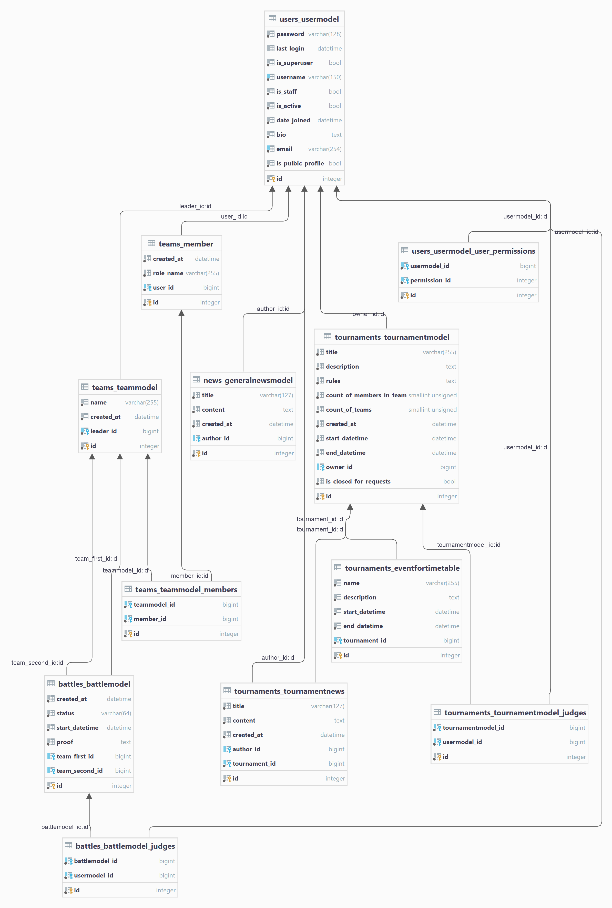

# MVP модель сайта GoodGameTournaments

## Новости
### Общие
От команды разработчиков, или сообщения о масштабных евентах
### Турнирные
Новости которые видны только внутри турниров

## Турниры

### Турнир
Структура турнира
- Название
- Автор(Владелец)
- Судьи
- Описание
- Правила
- число участников в одной команде(во всех командах одинаковое число участников, чтобы было справедливо)
- Максимальное число команд в турнире
- Дата и время начала проведения
- Дата и время окончания проведения
- Расписание по событьям
- Статус приема заявок на участие
  - Активен
  - Закрыт

### Битвы
Турнир это набор битв которые определяют победителя
структура битв
- 1 команда
- 2 команда
- статус битвы
  - Победа первой команды
  - Победа второй команды
  - Еще не провели
  - Не состоится
- Дата и время проведения
- Судьи
- Доказательства(Необязательное поле, ссылка на медиа ресурс чтобы любой пользователь сайта мог просмотреть доказательства статуса битвы)

### Заявка на участие в турнире
Структура заявки
- Команда
- Турнир
- Когда отправлено было заявление
- Статус заявления
  - Принято
  - Отклонено
  - Не принято
  - Просрочено

### Приглашение в команду
Чтобы поучаствовать в турнире нужно собрать команду и пригласить в нее других игроков
Сначало собираеться команда а после лидер может подать заявку на участие в турнире
Структура Приглашения
- Команда куда приглашаеться игрок
- Кто лидер, который отправил приглашение
- Приглашаемый игрок
- Когда отправлено было приглашение
- Срок приглашения(3 часа)
- Статус приглашения
  - Принято
  - Отклонено
  - Не принято
  - Просрочено

## ER диаграмма

